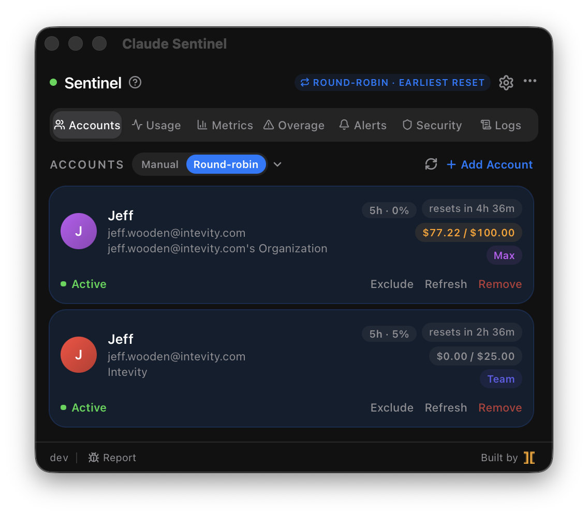
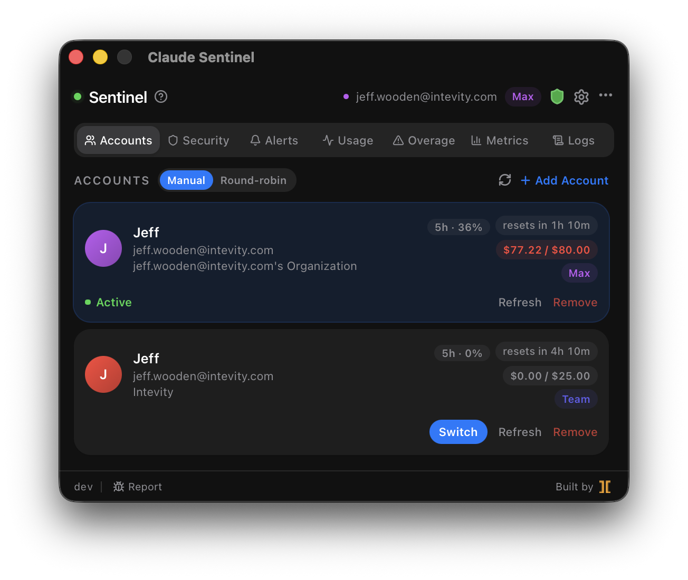
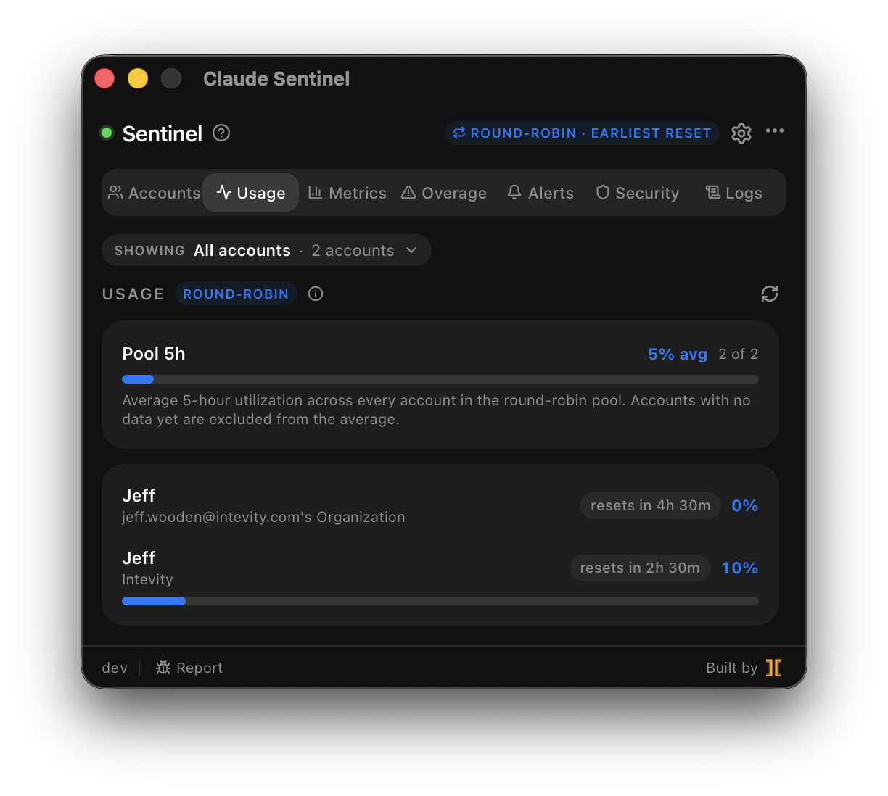
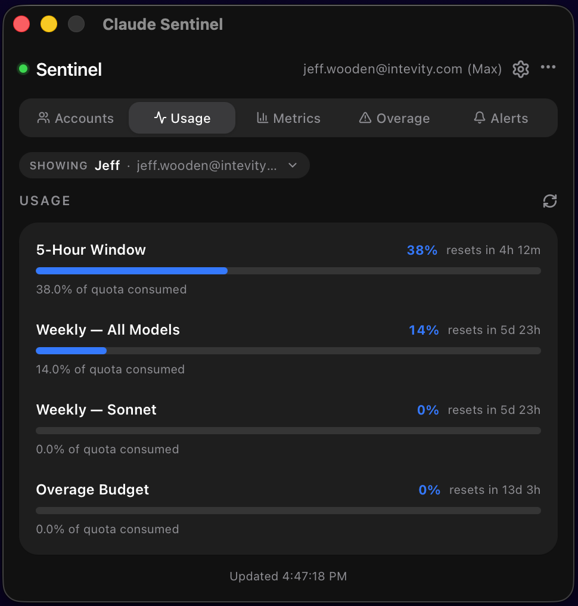
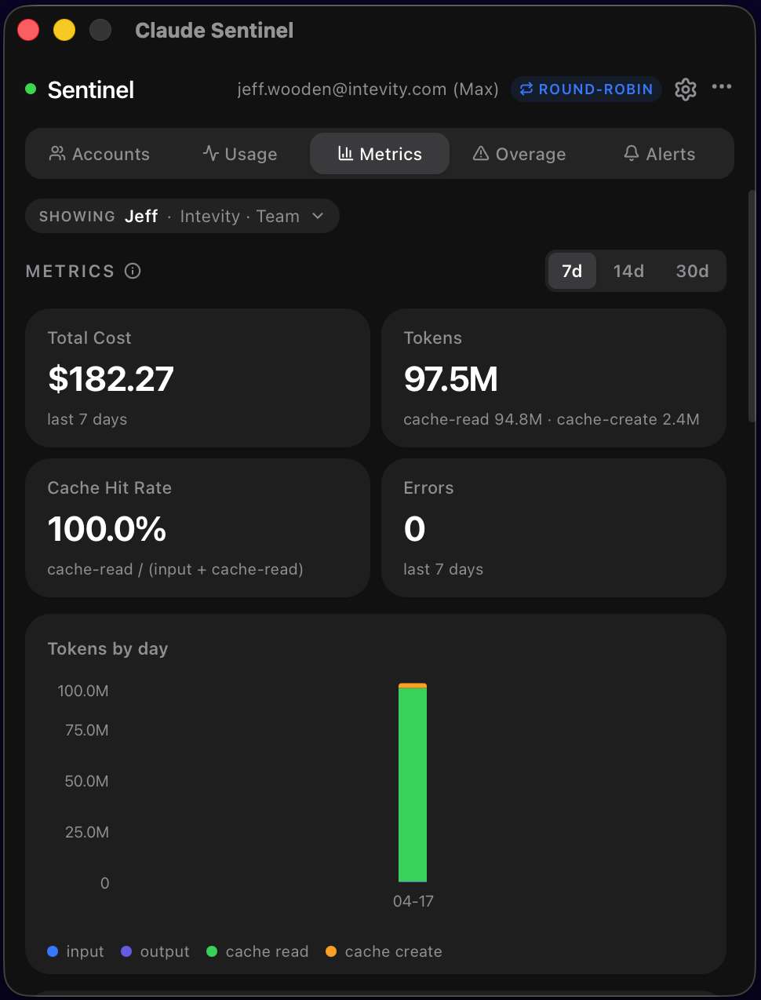
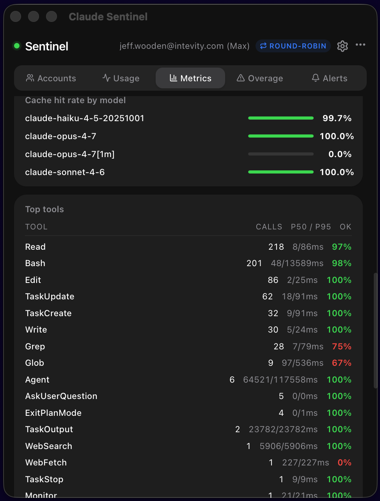
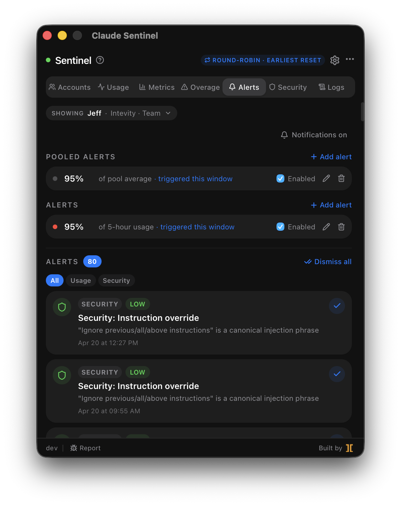
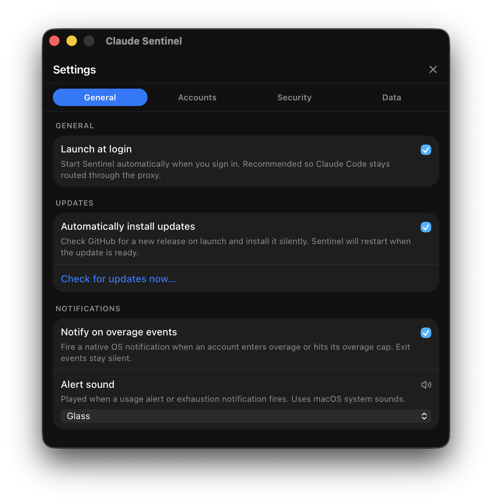

# Claude Sentinel

**Combine every Claude account you own into one. Rotate tokens automatically, see what Anthropic won't show you, and get notified the moment you enter overage.**

An open-source Claude Code companion: tray app + bundled daemon for multi-account routing, real-time overage alerts, honest usage metrics, and threshold-based notifications.

[](https://github.com/Intevity/claude-sentinel/actions/workflows/ci.yml)
[](https://github.com/Intevity/claude-sentinel/releases/latest)
[](https://github.com/Intevity/claude-sentinel/releases)
[](./LICENSE)
[](#download)
[](https://nodejs.org)
[](https://tauri.app)
[](https://www.typescriptlang.org)

---

## 🔀 Combine every account into one

Flip round-robin on and Sentinel rotates the OAuth token on every API request — your Max, Pro, and Team plans drain evenly, staying within ~1% of each other. Flip it off and you're back to one-click switching, with live 5-hour usage on every card so you always know which account has headroom.

<table>
<tr>
<th align="center">Round-robin <b>on</b> — combined pool</th>
<th align="center">Round-robin <b>off</b> — manual switching</th>
</tr>
<tr>
<td align="center"></td>
<td align="center"></td>
</tr>
</table>

## 📊 See what Anthropic hides

Claude Code tells you nothing about your rate-limit state. Sentinel shows the full picture: 5-hour window, weekly all-models, weekly Sonnet, and overage budget — color-coded by urgency with reset countdowns. In round-robin mode the Usage tab aggregates every account into a single **pool** bar so you know at a glance how close the *whole fleet* is to the wall.

<table>
<tr>
<th align="center">Pool view (round-robin)</th>
<th align="center">Per-account view</th>
</tr>
<tr>
<td align="center"></td>
<td align="center"></td>
</tr>
</table>

## 💸 Real cost. Real tokens. Real cache hit rate.

`~/.claude/stats-cache.json` reports `$0.00` for every subscription user. Sentinel captures Claude Code's OTEL telemetry directly and gives you the truth: per-model spend, input vs. cache-read token breakdown, cache hit rate, API error rates, and top-tool latency (p50/p95) — all over rolling 7/14/30-day windows.

<table>
<tr>
<th align="center">Cost & token breakdown</th>
<th align="center">Models, cache & errors</th>
</tr>
<tr>
<td align="center"></td>
<td align="center"></td>
</tr>
</table>

## 🔔 Know before you hit the wall

Set a threshold on the 5-hour window — 50%, 80%, 95%, whatever keeps you sane — and Sentinel fires a native OS notification the moment you cross it. Per-window deduped (one alert per rolling cycle, no spam), with a full history of every overage event, account switch, and threshold trigger so you can look back and actually understand your usage.

<p align="center"></p>

## ⚙️ One panel. Zero surprises.

Pick your switching mode (off / auto-switch at N% / round-robin), tune the auto-switch threshold, choose your notification sound, toggle launch-at-login — every behavior is in one place, and nothing ships on by default.

<p align="center"></p>

---

## ⬇️ Download

Grab the latest installer from the **[Releases page](https://github.com/Intevity/claude-sentinel/releases/latest)**, or pick your platform directly:

| Platform | Format | Download |
|---|---|---|
| **macOS** — Apple Silicon (M1/M2/M3/M4) | `.dmg` | [Latest release](https://github.com/Intevity/claude-sentinel/releases/latest) |
| **macOS** — Intel | `.dmg` | [Latest release](https://github.com/Intevity/claude-sentinel/releases/latest) |
| **Windows** 10/11 | `.msi` / NSIS | [Latest release](https://github.com/Intevity/claude-sentinel/releases/latest) |
| **Linux** (Debian/Ubuntu) | `.deb` | [Latest release](https://github.com/Intevity/claude-sentinel/releases/latest) |
| **Linux** (Fedora/RHEL) | `.rpm` | [Latest release](https://github.com/Intevity/claude-sentinel/releases/latest) |
| **Linux** (portable) | `.AppImage` | [Latest release](https://github.com/Intevity/claude-sentinel/releases/latest) |

> **macOS note:** v0.1.x builds ship unsigned. See the [first-launch Gatekeeper steps](#installation) below — it's a one-time right-click.

---

## What it does

- **Multi-account routing** — Enroll unlimited Claude accounts (Pro, Max, Team, Enterprise) and pick how they're used:
  - **Off** — manage accounts manually from the Accounts tab.
  - **Auto-switch** — when the active account's 5-hour usage reaches your threshold (50–99%, default 90%), Sentinel switches to the account with the most remaining capacity.
  - **Round-Robin** — rotate the OAuth token on every API request so usage drains across all accounts, keeping them within ~1% of each other.
- **Overage detection** — Intercepts `anthropic-ratelimit-unified-overage-*` response headers and fires a native OS notification the moment your session enters overage budget.
- **Usage visibility** — Every rate-limit window (5-hour, weekly all-models, weekly Sonnet, overage budget) rendered with reset countdowns and color-coded urgency. Round-robin mode aggregates every account into a pool view.
- **Real metrics** — OTEL telemetry gives you accurate cost, tokens, cache hit rate, and per-model breakdowns over 7/14/30-day windows. Unlike `~/.claude/stats-cache.json` (which reports `$0` for subscription users), these numbers are real.
- **User-configurable alerts** — Set a percentage threshold per 5-hour window; get a native notification when it trips. Deduped per window.
- **Notification history** — Every overage transition, account switch, threshold trigger, and auto-switch exhaustion in one scrollable timeline.

## Architecture

```
Claude Code  ──→  localhost:47284  ──→  api.anthropic.com
                  (sentinel daemon)
                        │
                        │  Unix socket / named pipe
                        ▼
                  Claude Sentinel App
                  (Tauri v2 tray app)
```

- **App** (`packages/app`) — Tauri v2 desktop tray application. Bundles and manages the daemon as a sidecar process and patches `~/.claude/settings.json` on activation so Claude Code routes through the proxy.
- **Daemon** (`packages/daemon`) — Node.js HTTP reverse proxy, OTLP telemetry receiver, MCP server, and SQLite store. Compiled into a self-contained binary and embedded inside the app bundle.

## Installation

### Prerequisites

- macOS 12+, Windows 10+, or Linux (libsecret required on Linux)
- [Claude Code](https://claude.ai/code) installed
- Node.js 22+ (for Claude Code itself; the Sentinel daemon ships its own runtime)

### First launch

1. **Install** using the [Download](#download) table above. The daemon is bundled inside the app — there is nothing else to install.

   > **macOS: first launch will show "unidentified developer"** — Claude Sentinel is not Apple-code-signed yet (v0.1.x ships unsigned while the project is in early access). To bypass Gatekeeper the first time:
   >
   > **Option A (one-click):** right-click `Claude Sentinel.app` in `/Applications` → **Open** → confirm **Open** in the dialog. macOS remembers the decision.
   >
   > **Option B (terminal):** clear the quarantine attribute before first launch:
   > ```sh
   > xattr -c "/Applications/Claude Sentinel.app"
   > ```
   >
   > If macOS says the app is "damaged and can't be opened," that's also the quarantine flag — Option B fixes it. Signed + notarized builds will land in a future release.

2. **Launch Claude Sentinel** from your Applications folder. The tray icon appears in the menu bar / system tray, and the daemon starts automatically.

3. **Click "Activate Sentinel"** in the banner that appears on first launch. This writes `ANTHROPIC_BASE_URL=http://localhost:47284` plus OTEL env vars into `~/.claude/settings.json` — the only setup step required.

4. **Restart Claude Code.** From this point on, every Claude Code session routes through the Sentinel proxy.

5. **Enroll accounts** via the tray app → **Add Account**, then follow the OAuth flow. In the browser OAuth consent page, make sure you're signed in to the org you want to add — the token is scoped to whichever org claude.ai is currently showing.

### Uninstall

Open the tray app → **⋯ menu → Uninstall Sentinel…**. The uninstall dialog lets you choose whether to also delete local data (usage history, rate-limit cache, keychain credentials). Uninstalling:
- Removes the Sentinel env vars from `~/.claude/settings.json` so Claude Code goes back to calling `api.anthropic.com` directly.
- Optionally wipes `~/.claude-sentinel/` and every `Claude Sentinel-credentials` keychain entry.
- Shuts the daemon down and quits the app.

The Sentinel app itself is still in `/Applications` after uninstall — trash it normally if you want to remove the binaries too.

### Check daemon health

```sh
curl http://localhost:47284/health
# {"status":"ok","pid":12345}
```

The in-app ⋯ menu also shows daemon pid and uptime.

## Window behavior

Sentinel is a tray-only app (no Dock icon). Closing the window with the red ⨉ (or ⌘W) hides it — the background daemon keeps running so Claude Code can continue routing through it. To fully stop Sentinel, use the ⋯ menu → **Quit Sentinel**, or the tray menu → **Quit Claude Sentinel**.

## Building from source

### Prerequisites

- pnpm 9+
- Rust stable (install via [rustup](https://rustup.rs))
- Node.js 22+
- **macOS**: Xcode Command Line Tools (`xcode-select --install`)
- **Linux**: `libgtk-3-dev libwebkit2gtk-4.1-dev libappindicator3-dev librsvg2-dev patchelf`
- **Windows**: [Visual Studio Build Tools](https://aka.ms/vs/17/release/vs_buildtools.exe) with the "Desktop development with C++" workload

### Setup

```sh
git clone https://github.com/Intevity/claude-sentinel
cd claude-sentinel
pnpm install

# Build the better-sqlite3 native module
cd node_modules/.pnpm/better-sqlite3@*/node_modules/better-sqlite3
npm run build-release
cd -
```

### Build the Tauri app (includes the daemon)

The daemon is compiled into a self-contained binary by `beforeBuildCommand` automatically — you do not build it separately.

```sh
# Current platform only
pnpm --filter @claude-sentinel/app run tauri:build

# Cross-compile for a specific macOS target
pnpm --filter @claude-sentinel/app run tauri:build -- --target aarch64-apple-darwin
pnpm --filter @claude-sentinel/app run tauri:build -- --target x86_64-apple-darwin
```

What `tauri:build` does internally:
1. Compiles the daemon TypeScript (`tsc`)
2. Runs `build:sidecar` — packages the daemon into a self-contained platform binary using [`@yao-pkg/pkg`](https://github.com/yao-pkg/pkg) and places it in `packages/app/src-tauri/binaries/`
3. Builds the React frontend (`vite build`)
4. Compiles the Rust Tauri backend and bundles everything

Artifacts land in `packages/app/src-tauri/target/release/bundle/`:

| Platform | Output |
|----------|--------|
| macOS    | `macos/Claude Sentinel.app`, `.dmg` |
| Linux    | `.deb`, `.rpm`, `.AppImage` |
| Windows  | `.msi`, NSIS installer |

### Build the daemon binary standalone

If you need just the daemon binary (e.g. for testing):

```sh
pnpm --filter @claude-sentinel/daemon run build          # tsc compile
pnpm --filter @claude-sentinel/daemon run build:sidecar  # pkg → platform binary
```

Output: `packages/app/src-tauri/binaries/claude-sentinel-daemon-<triple>[.exe]`

### Release via GitHub Actions

Pushing a `v*` tag triggers the release workflow automatically:

```sh
git tag v0.1.0
git push origin v0.1.0
```

The workflow builds the Tauri app (with daemon sidecar embedded) for all four platforms in parallel. When all builds pass, the draft release is automatically published.

Required repository secrets:

| Secret | Purpose |
|--------|---------|
| `TAURI_SIGNING_PRIVATE_KEY` | Tauri updater signing key |
| `TAURI_SIGNING_PRIVATE_KEY_PASSWORD` | Password for the above |
| `APPLE_CERTIFICATE` | Base64-encoded `.p12` for macOS code signing |
| `APPLE_CERTIFICATE_PASSWORD` | Password for the `.p12` |
| `APPLE_SIGNING_IDENTITY` | Developer ID Application identity string |
| `APPLE_ID` | Apple ID for notarization |
| `APPLE_PASSWORD` | App-specific password for notarization |
| `APPLE_TEAM_ID` | Apple Developer Team ID |

To generate a Tauri signing key pair:

```sh
pnpm tauri signer generate -w ~/.tauri/claude-sentinel.key
```

## Development

### Run tests

```sh
npx vitest run --coverage
```

All tests must maintain **≥95% coverage** across statements, branches, functions, and lines.

### Run the daemon locally

```sh
pnpm --filter @claude-sentinel/daemon run dev
```

### Run the Tauri app locally

Run the daemon first (above), then in a separate terminal:

```sh
pnpm --filter @claude-sentinel/app run tauri:dev
```

In dev mode the app will log a warning if the sidecar binary hasn't been built yet and skip spawning it — that's expected. The IPC module retries the socket connection automatically once the daemon is running.

### Project structure

```
claude-sentinel/
├── packages/
│   ├── daemon/src/            # Node.js daemon
│   │   ├── proxy.ts           # HTTP reverse proxy + overage header inspection
│   │   ├── otel-receiver.ts   # OTLP receiver
│   │   ├── ipc.ts             # Unix socket IPC
│   │   ├── db.ts              # SQLite schema + queries
│   │   ├── overage.ts         # Overage state machine
│   │   ├── accounts.ts        # OS credential store
│   │   ├── claude-state.ts    # ~/.claude.json management
│   │   ├── oauth.ts           # PKCE login flow
│   │   ├── settings.ts        # ~/.claude-sentinel/settings.json
│   │   ├── token-rotator.ts   # round-robin token selector
│   │   ├── auto-switch.ts     # threshold-based auto-switch
│   │   └── alerts.ts          # user-configured alert evaluator
│   ├── app/                   # Tauri desktop app
│   │   ├── src/               # React frontend (Accounts / Usage / Metrics / Overage / Alerts tabs)
│   │   └── src-tauri/         # Rust backend
│   │       └── src/
│   │           ├── main.rs             # Tauri entry + window event handling
│   │           ├── daemon.rs           # sidecar spawn logic
│   │           ├── ipc.rs              # Unix socket bridge to daemon
│   │           ├── settings_patch.rs   # activate / deactivate Sentinel
│   │           └── tray.rs             # system tray menu
│   └── shared/src/            # Shared TypeScript types
```

## Debugging

### Daemon logs

The daemon writes timestamped logs to `~/.claude-sentinel/daemon.log`. This file is the first place to look for any issue — OAuth failures, account switch errors, proxy problems, and IPC events are all logged there.

```sh
# Stream logs in real time
tail -f ~/.claude-sentinel/daemon.log

# Last 100 lines
tail -100 ~/.claude-sentinel/daemon.log

# Filter to OAuth events only
grep '\[OAuth\]' ~/.claude-sentinel/daemon.log

# Filter to errors
grep 'ERROR' ~/.claude-sentinel/daemon.log
```

The file appends across app restarts and is never truncated automatically. Rotate it manually if it grows large:

```sh
> ~/.claude-sentinel/daemon.log
```

### Check daemon health

The daemon exposes a `/health` endpoint on its proxy port:

```sh
curl http://localhost:47284/health
# {"status":"ok","pid":12345}
```

If this returns an error or times out, the daemon is not running. Relaunch the app or check the log for a startup crash. The ⋯ menu inside the app also shows live pid/uptime.

### Check the IPC socket

The app communicates with the daemon over a Unix socket:

```sh
ls -la ~/.claude-sentinel/daemon.sock
```

If the socket file is missing after the app is running, the daemon failed to start. Check the log for details.

### App-side logs (DevTools)

When running the app in dev mode (`pnpm --filter @claude-sentinel/app run tauri:dev`), open DevTools from the system tray menu and look at the Console tab. The app logs every incoming daemon message:

```
[Sentinel] daemon-message: { type: 'account_switched', ... }
[Sentinel] daemon-message: { type: 'login_complete', ... }
```

### Common issues

**"No credentials stored for this account"** when switching
The daemon stores credentials per account UUID the first time you sync. Open the app, click **Sync** while each account is active in Claude Code (one at a time) to capture its token. After syncing both accounts, switching works without re-login.

**Add Account completes but Sentinel shows a blue "already added" notice**
The OAuth consent page returned a token for an org you already have. This happens when your claude.ai browser session is signed in to a different org than the one you wanted to add. Open claude.ai in the browser, use the org selector (top-left sidebar) to switch to the org you want to add, then click **Add Account** again.

**Add Account completes in browser but app shows "Login failed or was cancelled"**
Check the daemon log for an `[OAuth]` error after the callback. Common causes:
- `Token exchange failed (400)` — the authorization code expired (took too long to complete the flow); try again
- `security: SecKeychainItemAdd` error — macOS denied keychain write; check System Settings → Privacy & Security → Keychain

**Proxy not intercepting Claude Code requests**
Verify `~/.claude/settings.json` contains `ANTHROPIC_BASE_URL=http://localhost:47284`. If it's missing, click **Activate Sentinel** in the app, then restart Claude Code.

**App icon missing from menu bar**
macOS hides menu bar icons when the bar is full. Drag to reveal, or hold ⌘ and drag the icon to reorder/uncover it.

## How overage detection works

Claude Code routes all API calls through the sentinel daemon (`ANTHROPIC_BASE_URL=http://localhost:47284`). On each response from Anthropic, the daemon inspects:

```
anthropic-ratelimit-unified-overage-status: active
anthropic-ratelimit-unified-overage-reset: 1776700800
```

A state machine tracks `isUsingOverage` per account UUID. When it transitions from `false → true`, the daemon:
1. Writes an overage event to SQLite
2. Sends `{ type: 'overage_entered', accountId, resetsAt }` to the Tauri app via IPC
3. The Tauri app fires a native OS notification

The response is forwarded to Claude Code unmodified — the proxy is transparent.

## Security

- The proxy only listens on `127.0.0.1:47284` — never exposed to the network.
- Inactive account credentials are stored in the OS keychain (Keychain on macOS, Credential Manager on Windows, libsecret on Linux) under the service name `Claude Sentinel-credentials`.
- The daemon never logs credential values — only metadata (email, UUID) is stored in SQLite.
- The IPC socket is created with `0600` permissions (owner read/write only).
- `~/.claude.json` and `~/.claude/settings.json` writes use atomic rename.

## License

MIT © Jeff Wooden
